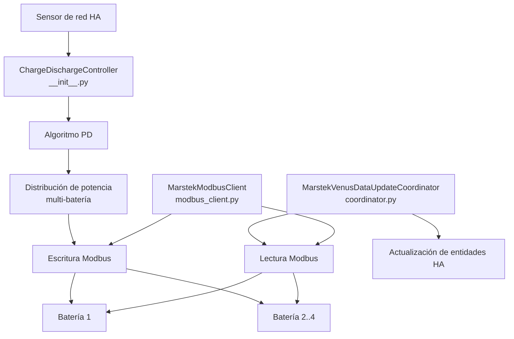

# Arquitectura

## Componentes principales



## Módulos

| Archivo | Clase principal | Responsabilidad |
|---|---|---|
| `__init__.py` | `ChargeDischargeController` | Bucle de control principal (dirigido por eventos del sensor de red + watchdog de 2 s), algoritmo PD, distribución multi-batería |
| `coordinator.py` | `MarstekVenusDataUpdateCoordinator` | Polling periódico de datos Modbus, actualización de entidades |
| `modbus_client.py` | `MarstekModbusClient` | Comunicación TCP asíncrona con pymodbus, reintentos con backoff |
| `config_flow.py` | — | Asistente de configuración multi-paso en HA UI |
| `const.py` | — | Definiciones de todos los registros Modbus y entidades |
| `aggregate_sensors.py` | — | Sensores agregados del sistema (suma de todas las baterías) |
| `calculated_sensors.py` | — | Sensores derivados calculados (ciclos, estimaciones) |
| `balance_monitor.py` | `CellBalanceMonitor` | Medición del spread de tensión de celdas tras la carga completa e historial de salud |
| `non_responsive_tracker.py` | `NonResponsiveTracker` | Detección de baterías sin respuesta y ventanas de exclusión de 5 minutos |
| `alarm_notifier.py` | `AlarmNotifier` | Detección de cambios de bits de alarma/fallo y formateo de notificaciones persistentes de HA |
| `weekly_full_charge.py` | `WeeklyFullChargeManager` | Estado de carga semanal completa, persistencia y orquestación de escritura de registros |
| `consumption_tracker.py` | `ConsumptionTracker` | Historial de consumo, acumuladores de energía diaria, detección de tiempos solares, backfill del recorder y captura diaria a las 23:55 |

## Flujo de datos

```
Sensor de red → Controlador (PD) → Distribución de potencia → Escritura Modbus → Baterías
                      ↑
Coordinador → Lectura Modbus → Actualización de entidades
```

## Intervalos de polling

| Intervalo | Período | Registros |
|---|---|---|
| `high` | 2 s | Potencia, SOC |
| `medium` | 5 s | Tensión, corriente, temperatura |
| `low` | 30 s | Energía acumulada, alarmas |
| `very_low` | 600 s | Info de dispositivo, firmware |
