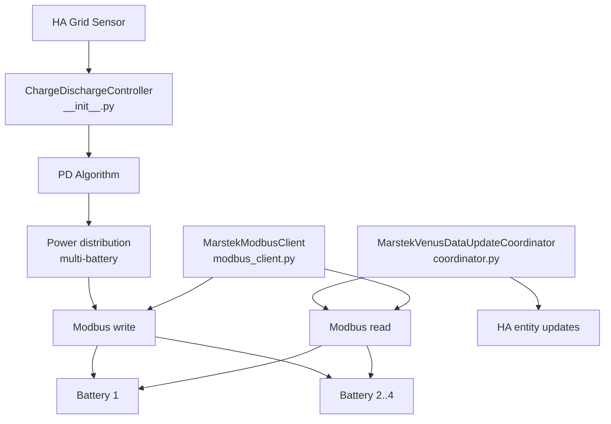

# Architecture

## Main components



## Modules

| File | Main class | Responsibility |
|---|---|---|
| `__init__.py` | `ChargeDischargeController` | Main control loop (event-driven on the grid sensor + 2 s watchdog), PD algorithm, multi-battery distribution |
| `coordinator.py` | `MarstekVenusDataUpdateCoordinator` | Periodic Modbus data polling, entity updates |
| `modbus_client.py` | `MarstekModbusClient` | Async TCP communication via pymodbus, retries with backoff |
| `config_flow.py` | — | Multi-step configuration wizard in HA UI |
| `const.py` | — | All Modbus register and entity definitions |
| `aggregate_sensors.py` | — | System aggregate sensors (sum across all batteries) |
| `calculated_sensors.py` | — | Derived calculated sensors (cycle count, estimates) |
| `balance_monitor.py` | `CellBalanceMonitor` | Post-full-charge cell voltage spread measurement and health history |
| `non_responsive_tracker.py` | `NonResponsiveTracker` | Non-responsive battery detection and 5-minute exclusion windows |
| `alarm_notifier.py` | `AlarmNotifier` | Alarm/fault bit-delta detection and HA persistent notification formatting |
| `weekly_full_charge.py` | `WeeklyFullChargeManager` | Weekly full charge state, persistence and register-write orchestration |
| `consumption_tracker.py` | `ConsumptionTracker` | Consumption history, daily energy accumulators, solar-timing detection, recorder backfill, and 23:55 daily capture |

## Data flow

```
Grid sensor → Controller (PD) → Power distribution → Modbus write → Batteries
                    ↑
Coordinator → Modbus read → Entity updates
```

## Polling intervals

| Interval | Period | Registers |
|---|---|---|
| `high` | 2 s | Power, SOC |
| `medium` | 5 s | Voltage, current, temperature |
| `low` | 30 s | Accumulated energy, alarms |
| `very_low` | 600 s | Device info, firmware |
